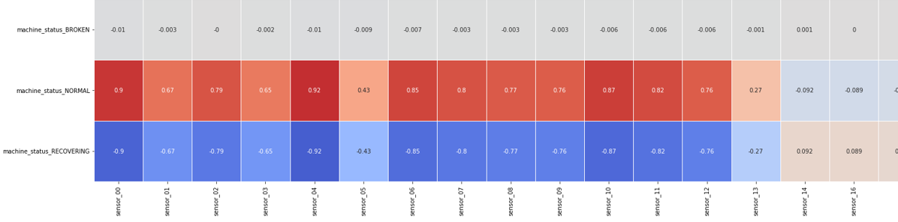

# Sensor Status Classification - Machine Learning Project

## Project Overview
This project focuses on the **classification of water pump system failures** using **sensor data** and **machine learning models**. The goal is to predict **system malfunctions** before they occur, enabling **preventive maintenance** to avoid costly downtimes. The dataset consists of readings from **52 sensors** monitoring a water pump system.

### Key Objectives:
- Identify the **most significant sensors** affecting system failures.
- Develop **high-accuracy predictive models** for **system failure detection**.
- Compare the performance of **Random Forest** and **XGBoost** classifiers.
- Use **visualizations** to interpret the results and model performance.

---
## Business Understanding
### Problem Statements
1. **Which sensors have the most influence on system failures?**
2. **Which machine learning model performs best in predicting system failures?**

### Solution Approach
- **Data Preprocessing**: Handle missing values, balance dataset, and scale numerical features.
- **Feature Selection**: Analyze **correlation matrices** to determine the most relevant sensors.
- **Model Training**: Train and compare **Random Forest** and **XGBoost** models.
- **Evaluation Metrics**: Assess models using **accuracy, precision, recall, and F1-score**.

---
## Data Understanding
### Dataset Source
- The dataset consists of water pump sensor readings over time.
- Access the dataset: [Pump Sensor Data](https://www.kaggle.com/datasets/nphantawee/pump-sensor-data/data)

### Key Features:
| Column          | Description  |
|----------------|--------------|
| `timestamp`   | Time of recorded sensor data |
| `sensor_00` - `sensor_51` | Raw sensor readings |
| `machine_status` | Operational status (NORMAL, BROKEN, RECOVERING) |

### **Exploratory Data Analysis**
1. **Correlation Matrix Analysis**
   - Identifies sensors most correlated with failures.
   - **Most relevant sensors**: `sensor_0 - sensor_12` for general failure prediction.
   - **Critical sensors for broken systems**: `sensor_44 - sensor_51`.

   

2. **Class Distribution Before Resampling**
   - The dataset is highly **imbalanced**, requiring **oversampling** to balance class distribution.
   

---
## Data Preprocessing
### 1. Handling Missing Values
- **Forward Fill** applied to missing values since data is time-series based.

### 2. Feature Selection
- Dropped irrelevant features with low correlation to failures.

### 3. Data Resampling
- **Oversampling** was applied to minority classes to ensure balanced training.

---
## Model Development
### **1. Random Forest Classifier**
- **Ensemble of Decision Trees** trained in parallel.
- Uses **majority voting** for final predictions.
```python
from sklearn.ensemble import RandomForestClassifier
model_rf = RandomForestClassifier(n_estimators=150, max_depth=20, random_state=42)
```

### **2. XGBoost Classifier**
- **Boosting technique** that trains models sequentially, improving misclassified points at each iteration.
```python
from xgboost import XGBClassifier
model_xgb = XGBClassifier(n_estimators=150, max_depth=20, learning_rate=0.1, random_state=42)
```

---
## Model Evaluation
### **Performance Metrics**
| Metric        | Formula  |
|--------------|-----------------------------------------------------------|
| **Accuracy** | (TP + TN) / (TP + FP + FN + TN) |
| **Precision** | TP / (TP + FP) |
| **Recall** | TP / (TP + FN) |
| **F1 Score** | 2 * (Precision * Recall) / (Precision + Recall) |

### **Confusion Matrix Comparisons**
1. **Random Forest Confusion Matrix**
   

2. **XGBoost Confusion Matrix**
   

3. **Zoomed Correlation Matrix for Better Analysis**
   

---
## Repository Structure
```
📂 project_root/
├── 📂 images/                         # Contains heatmaps & confusion matrices
│   ├── correlation_heatmap.png       # Correlation heatmap of sensor readings
│   ├── labels.png                    # Class distribution plot
│   ├── conf_matrix.png               # Random Forest confusion matrix
│   ├── conf_matrix2.png              # XGBoost confusion matrix
│   ├── corr_matrix_zoomed.png        # Zoomed correlation matrix
├── 📜 sensor_status_classification.ipynb  # Jupyter Notebook for model development
├── 📜 sensor_status_classification.py    # Python script for classification
├── 📜 README.md                          # Project documentation
```

---
## Key Takeaways
- **Most significant sensors**: `sensor_0 - sensor_12` and `sensor_44 - sensor_51`.
- **Best-performing model**: **Random Forest**, as it minimizes false alarms.
- **Future improvements**:
  - Experimenting with **deep learning models**.
  - Incorporating **real-time sensor streaming**.

---
## How to Replicate the Project
### **1. Clone the Repository**
```bash
git clone <repository_url>
cd sensor-status-classification
```

### **2. Install Dependencies**
```bash
pip install -r requirements.txt
```

### **3. Run Jupyter Notebook**
```bash
jupyter notebook sensor_status_classification.ipynb
```

### **4. Run Python Script for Classification**
```bash
python sensor_status_classification.py
```
